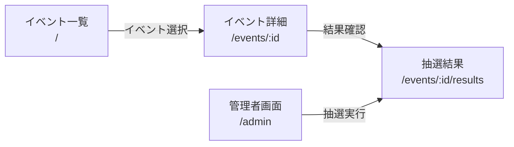
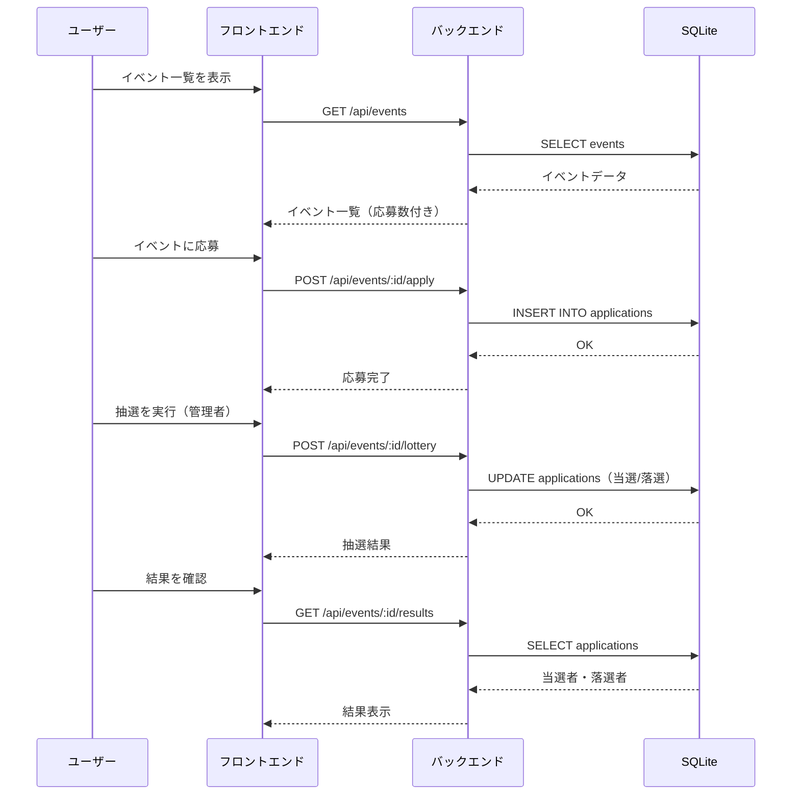

# ライブ抽選アプリ

ライブチケットの抽選を行う Web アプリケーション。
ユーザーがイベントに応募し、管理者が抽選を実行して当選者を決定する。

## 技術スタック

| レイヤー | 技術 |
|----------|------|
| フロントエンド | Vue 3 + TypeScript、Bootstrap 5 |
| バックエンド | Express + TypeScript |
| データベース | SQLite（better-sqlite3）|

## セットアップ

```bash
npm run setup   # 依存インストール + DB 初期化
npm run dev     # 起動（バックエンド :3000 / フロントエンド :8080）
```

## フォルダ構成

```
├── backend/src/
│   ├── index.ts            # Express サーバー
│   ├── database.ts         # SQLite 接続・スキーマ定義
│   ├── routes/api.ts       # REST API（/api/events 配下）
│   ├── seed.ts             # シードデータ投入
│   └── types/index.ts      # 型定義
├── frontend/src/
│   ├── views/              # ページ（EventList, EventDetail, AdminPanel, LotteryResult）
│   ├── components/         # 共通コンポーネント（Navbar, EventCard, ApplicationForm, LotteryAnimation）
│   ├── services/api.ts     # API クライアント
│   ├── router/index.ts     # ルーティング定義
│   └── types/index.ts      # 型定義
└── docs/                   # ドキュメント
```

## 画面フロー



## API フロー


